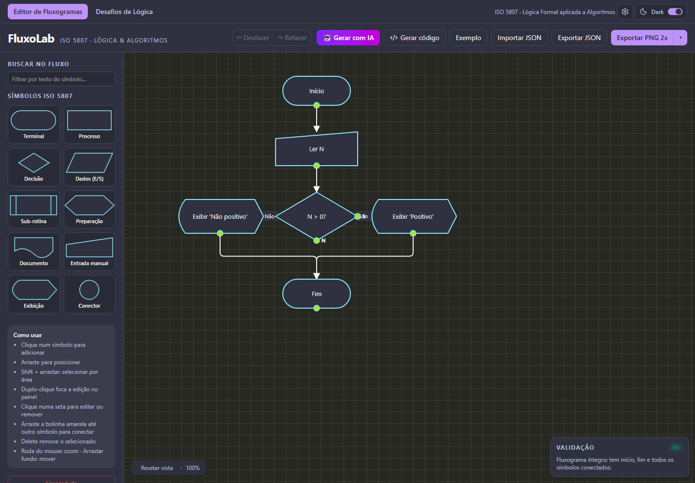
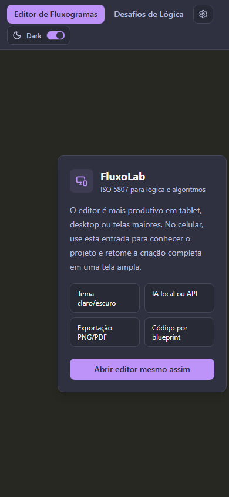
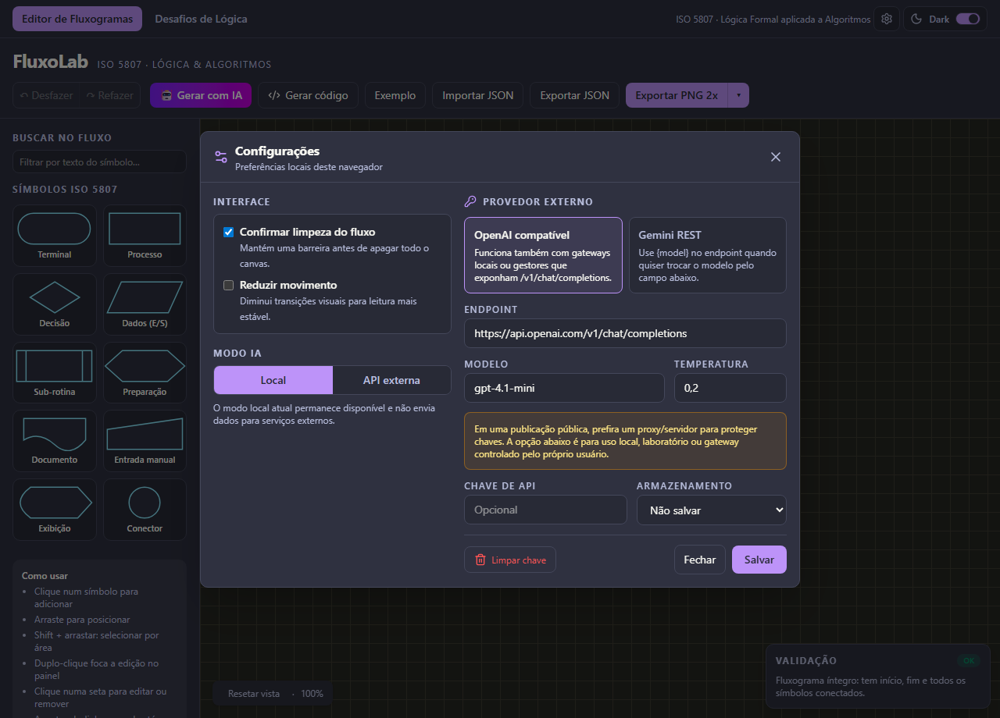

# FluxoLab

Criador visual de fluxogramas ISO 5807 para aulas de lógica, algoritmos e engenharia de software.
O projeto inclui editor interativo, desafios didáticos, validação do fluxo, exportação e geração de
código por blueprints.

## Origem

- Desenvolvedor: Rubens Lyra
- Canal: @rubinholyralabs
- LinkedIn: @rubenslyra
- TikTok: @rubinholyralabs

## Recursos

- Editor ISO 5807 com seleção por área usando `Shift + arrastar`.
- Painel de validação do fluxo, busca, zoom, importação/exportação JSON, PNG, SVG e PDF.
- Tema claro e escuro inspirado em Drácula/Monokai.
- Modo IA local, sem conta externa e sem envio de dados.
- Configuração opcional de provedor externo OpenAI compatível ou Gemini REST.
- Geração de código a partir do fluxograma para Python, C#, Java, JavaScript e C/C++.
- Experiência introdutória mobile e uso completo recomendado em tablet, desktop ou telas maiores.

## Prints

> As imagens abaixo são os alvos de documentação da release. Gere novamente após mudanças visuais.





## Execução local

```bash
bun install
bun run dev
```

Build de produção com base `/fluxolab/`:

```bash
bun run build:fluxolab
```

Build estático para Hostinger, sem Node no servidor:

```bash
bun run build:hostinger
```

Esse comando gera `release/fluxolab-hostinger.zip`. Envie o conteúdo do ZIP para
`public_html/fluxolab/`. A pasta contém `index.html`, assets estáticos e um `.htaccess` para fallback
de SPA em Apache/LiteSpeed.

Se a URL pública correta for `/fluxlab/`, gere o pacote alternativo:

```bash
bun run build:hostinger:fluxlab
```

Nesse caso, o diretório no servidor também deve corresponder à URL, por exemplo
`public_html/fluxlab/`, salvo se houver uma regra de alias no servidor.

Execução via Docker:

```bash
docker compose up -d --build
```

Depois acesse:

```text
http://localhost:8088/fluxolab/
```

## Modo IA e chaves

O FluxoLab funciona sem chave no modo local. O painel de configurações permite somar um provedor
externo para uso local, laboratório ou gateway controlado pelo usuário.

Para publicação pública, não exponha chaves de API diretamente no frontend. Use um backend/proxy
para guardar segredos e aplicar controle de uso. As opções de chave no navegador existem para
instalações locais ou cenários didáticos controlados.

## Boas práticas adotadas

- Estado persistido carregado após a hidratação para evitar divergência entre SSR e cliente.
- Segredos e arquivos sensíveis excluídos de `.gitignore` e `.dockerignore`.
- Headers de segurança básicos no Nginx: `nosniff`, `Referrer-Policy`, `X-Frame-Options`,
  `Permissions-Policy` e CSP restrita a `base-uri`, `object-src` e `frame-ancestors`.
- Exportação imprimível sem `document.write`; uso de Blob URL.
- CSP sem `script-src` rígido nesta fase porque o runtime SSR do TanStack injeta scripts inline.

## Referências de engenharia

- Refactoring Guru: padrões de projeto e organização de responsabilidades.
- Microsoft Learn: Design Patterns e Template Method.
- MDN Web Docs: modelo de padrões da web, HTML, CSS, JavaScript e APIs do navegador.
- IBM: fundamentos de arquitetura, integração e governança de sistemas.
- Martin Fowler: padrões de arquitetura, refatoração e organização de aplicações.

## Notas de versão

Consulte [CHANGELOG.md](CHANGELOG.md).

## Segurança

Consulte [SECURITY.md](SECURITY.md).
