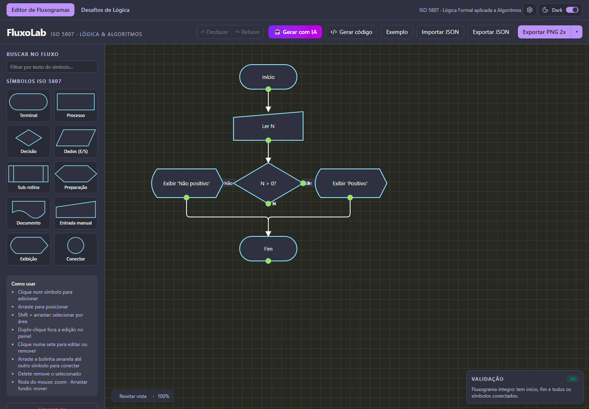
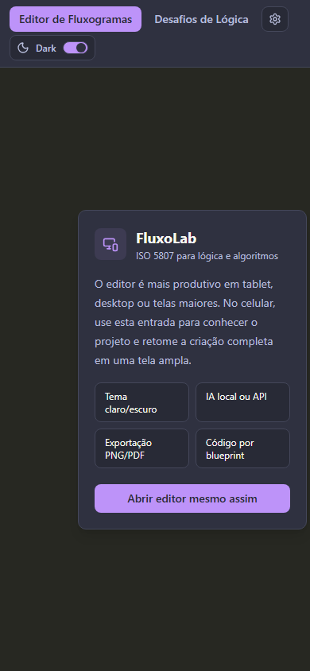
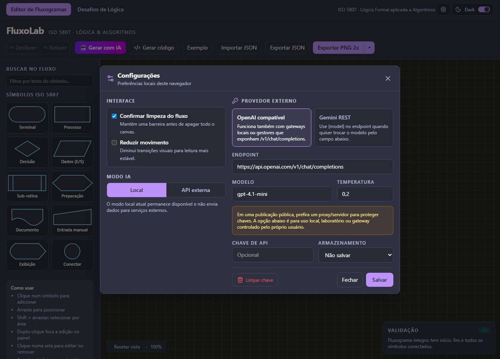

# FluxoLab

<p align="center">
  
</p>

FluxoLab é um criador visual de fluxogramas ISO 5807 para ensino de lógica, algoritmos e engenharia de software. A aplicação combina editor interativo, validação estrutural, desafios didáticos, exportação de artefatos e geração de código por blueprints.

**Release atual:** `v0.2.0`  
**Licença:** `CC BY-NC-SA 4.0` para uso educacional, comunitário e não comercial.

## Recursos

- Editor ISO 5807 com símbolos clássicos, agrupadores semânticos e conexões por portas nos quatro lados dos nós.
- Arestas tipadas para fluxo padrão, verdadeiro, falso, laço e retorno, com rótulos automáticos para decisões.
- Curvas automáticas para reduzir sobreposição visual, incluindo fan-out e arestas de retorno.
- Inspector de nós com rótulo visual, nome técnico, alinhamento, fonte, tamanho, entrelinha e formato de lista.
- Painel de validação com detecção de ilhas, decisões incompletas, conexões duplicadas e caminhos pendentes intencionais.
- Exportação JSON, PNG, SVG e PDF com metadados de versão e licença.
- Geração de código para Python, C#, Java, JavaScript e C/C++, além de PlantUML e scripts SQL.
- Blueprints procedural, template method, strategy e command pipeline orientados pelo desenho do fluxo.
- Desafios de lógica aplicada para prática em sala, com impressão/exportação segura.
- Aba "Boas Práticas" com documentações oficiais e livros técnicos para continuidade do projeto.
- Modo IA local sem envio de dados e configuração opcional de provedor externo controlado pelo usuário.
- Tema claro/escuro, tela introdutória e políticas públicas de uso, privacidade e cookies.

## Execução local

Requisitos:

- Bun 1.3 ou superior.
- Node compatível com Vite/TanStack quando necessário pelo ambiente.

```bash
bun install
bun run dev
```

Comandos úteis:

```bash
bun run test
bunx tsc --noEmit
bun run lint
bun run build
```

## Build e publicação

Build de produção com base `/fluxolab/`:

```bash
bun run build:fluxolab
```

Build estático para hospedagem compartilhada sem Node no servidor:

```bash
bun run build:hostinger
```

Esse comando gera `release/fluxolab-hostinger.zip`. Envie o conteúdo do ZIP para `public_html/fluxolab/`. A pasta inclui `index.html`, assets estáticos, `.htaccess` para fallback SPA em Apache/LiteSpeed e um exemplo de Nginx.

Se a URL pública correta for `/fluxlab/`, gere o pacote alternativo:

```bash
bun run build:hostinger:fluxlab
```

Execução via Docker:

```bash
docker compose up -d --build
```

Depois acesse:

```text
http://localhost:8088/fluxolab/
```

## Modo IA e chaves

O FluxoLab funciona sem chave no modo local. O painel de configurações permite usar um provedor externo OpenAI compatível ou Gemini REST, sempre a partir de configuração feita pelo usuário.

Para publicação pública, não exponha chaves de API diretamente no frontend. Use um backend ou proxy para guardar segredos, aplicar controle de uso e auditar chamadas. As opções de chave no navegador existem para instalações locais ou cenários didáticos controlados.

## Licença e uso comunitário

FluxoLab é disponibilizado sob a licença [Creative Commons Attribution-NonCommercial-ShareAlike 4.0 International](https://creativecommons.org/licenses/by-nc-sa/4.0/) (`CC BY-NC-SA 4.0`).

Você pode estudar, compartilhar e adaptar o projeto, desde que mantenha a atribuição a Rubens Lyra / Rubens Lyra Labs, preserve a mesma licença em trabalhos derivados e não use, revenda ou incorpore o projeto em produtos ou serviços comerciais sem autorização prévia por escrito.

## Origem

- Desenvolvedor: Rubens Lyra
- Canal: @rubinholyralabs
- LinkedIn: @rubenslyra
- TikTok: @rubinholyralabs

## Prints

> As imagens abaixo são os alvos de documentação da release. Gere novamente após mudanças visuais.





## Boas práticas adotadas

- Estado persistido carregado após hidratação para evitar divergência entre SSR e cliente.
- Segredos e arquivos sensíveis excluídos de `.gitignore` e `.dockerignore`.
- Headers de segurança básicos no Nginx: `nosniff`, `Referrer-Policy`, `X-Frame-Options`, `Permissions-Policy` e CSP restrita a `base-uri`, `object-src` e `frame-ancestors`.
- Exportação imprimível sem `document.write`; uso de Blob URL.
- CSP sem `script-src` rígido nesta fase porque o runtime SSR do TanStack injeta scripts inline.
- Dependências de UI reduzidas ao componente usado pelo editor.

## Notas de versão

Consulte [CHANGELOG.md](CHANGELOG.md) e [RELEASE_NOTES_0.2.0.md](RELEASE_NOTES_0.2.0.md).

## Segurança

Consulte [SECURITY.md](SECURITY.md).
